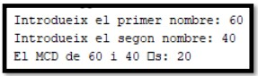
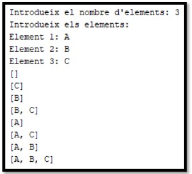
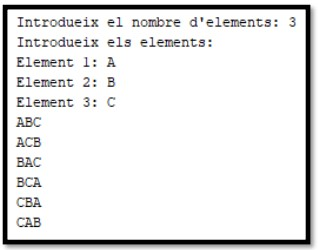
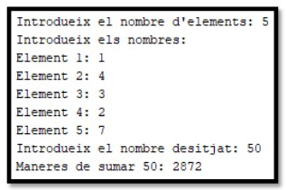

# 1. FUNCIONS

## 1.1. Funcions - Nivell A

Nota: Cap funció mostrarà res per pantalla llevat que es diga el contrari.

1. Escriu un programa que demane dos nombres reals per teclat i mostre per pantalla el resultat de multiplicar-los. Implementa i utilitza la funció:  

```java
// Retorna la multiplicació de dos números.
double multiplica(double a, double b) 
```

2. Escriu un programa que demane l'edat per teclat i mostre per pantalla si eres major d'edat o no. Implementa i utilitza la funció:

```java
// Retorna vertader si a>=18, fals en cas contrari
boolean esMajorEdat(int a) 
```

3. Escriu un programa que demane dos nombres enters per teclat i mostre per pantalla com és el mínim. Implementa i utilitza la funció:

```java
// Retorna el menor entre a i b
int minim(int a, int b) 
```

4. Escriu un programa que demane un nombre enter per teclat i mostre per pantalla si és positiu, negatiu o zero. Implementa i utilitza la funció:

```java
// Retorna -1 si es negatiu, 0 si es sigual a 0 , 1 si es positiu
int dimeSigne(int a) 
```

5. Escriu un programa que demane un valor sencer en milles i mostre el seu equivalent en quilòmetres. Recorda que una milla són 1,60934 quilòmetres. Implementa i utilitza la funció:

```java
// Retorna la conversió de milles a quilòmetres
double milles_a_quilometres(int milles)
```

6. Escriu un programa que demane cinc preus i mostre per pantalla el preu de venda de cadascun després d’aplicar-li un 21% d'IVA. Implementa i utilitza la funció:

```java
// Retorna el preu després de sumar-li un 21% d'IVA
double preuAmbIVA(double preu) 
```

7. Escriu un programa que demane l'ample i alt d'un rectangle i mostre per pantalla la seua àrea i el seu perímetre. Implementa i utilitza les funcions:

```java
// Retorna el perímetre
double perimetreRectangul(double ample, double alt)

// Retorna l'àrea
double areaRectangul(double ample, double alt) 
```

8. Escriu un programa que demane un valor N sencer i després mostre: el sumatori des d’1 a N, el productori d'1 a N i el valor intermedi entre 1 i N. Implementa i utilitza les funcions:

```java
// Retorna la suma d'enters d'1 a n
int suma1aN(int n) 

// Retorna el producte d'enters d'1 a n
int producte1aN(int n)

// Retorna el valor intermedi entre 1 i n
double intermedi1aN(int n) 
```

## 1.2. Funcions - Nivell B

9. Realitza un programa que demane introduir tres valors sencers i ens diga quin d'ells és el més elevat. Implementa-ho creant únicament una funció a la qual li passem dos valors (no tres) i ens retorne el màxim dels dos valors.
10. Realitza un programa que llija una data introduint el dia, mes i any per separat i ens diga si la data és correcta o no. Suposarem que tots els mesos tenen 30 dies. S'ha de crear una funció on li passem les dades i retorne si és correcta o no.
11. Realitza un programa que escriga la taula de multiplicar d'un número introduït per teclat. Per a això implementa una funció que reba com a paràmetre un nombre enter i mostre per pantalla la taula de multiplicar d'aquest número.
12. Realitza un programa que donat un valor en quilòmetres ens el tradueix a milles. El programa ha de tindre una funció que reba com a paràmetre una quantitat en quilòmetres i ens la retorne en milles.
13. Realitza un programa que calcule el percentatge de descompte que ens han fet en comprar alguna cosa. S'ha de sol·licitar la quantitat sense descompte i la quantitat amb el descompte aplicat. S’ha de crear una funció a la qual li passem tots dos valors i ens retorne el descompte.
14. Escriu una funció que mostre per pantalla un triangle com el de l'exemple. Haurà de rebre dos paràmetres: el caràcter que es desitja imprimir i el nombre de línies del triangle.  


15.  Escriu un programa que cree un array de grandària 100 amb els primers 100 nombres naturals. Després mostra la suma total i la mitjana. Implementa una funció que calcule la suma d'un array i una altra que calcule la mitjana d'un array.
16.  Escriu un programa que cree un array de la grandària indicada per teclat i després l'emplene amb valors aleatoris (utilitza Math.random()). Implementa la funció que emplena un array amb valors aleatoris.

## 1.3. Funcions - Nivell C

17. Realitza un programa que ens demane número sencers fins que s'introduïsca el 0, dient-nos, per a cada número introduït si és cosí o no. Cal recordar que un número és cosí si és divisible per si mateix i per 1. L'1 no és cosí per conveni. S'ha de crear una funció que passant-li un nombre enter retorne si és cosí o no.
18. El NIF (o lletra associada a un DNI) s'obté de la següent manera: Es divideix el número de DNI entre 23 i la resta és codificada per una lletra segons la següent equivalència:  
0: "T", 1: "R", 2: "W", 3: "A", 4: "G", 5: "M", 6: "I", 7: "F", 8: "P", 9: "D", 10:"X", 11: "B", 12: "N", 13: "J", 14: "Z", 15: "S", 16: "Q", 17: "V", 18: "H", 19: "L", 20: "C", 21: "K", 22: "E .."  
Escriu un programa que demane el DNI i mostre per pantalla la lletra associada. Per a això s'haurà de crear una funció a la qual se li passe el número i retorne la lletra.

Exemple: per al DNI 56321122 el NIF és ‘X’.

19. Realitza un programa que permeta comprovar si una terna de valors sencers (3 valors) s'ajusta a l'equació de Pitàgores: x ² + i ² = z ². El programa sol·licita a l'usuari els valores x, i, z. S'haurà de crear una funció a la qual se li passe x, i, z i retorne si són iguals o no.

Per exemple: 3 ² + 4 ² = 5 ².

20. Escriu un programa que imprisca les taules de multiplicar de l'1 al 10. Implementa una funció que reba un nombre enter com a paràmetre i imprimisca la seua taula de multiplicar.
21. Escriu un programa que mostre un menú amb 2 opcions: “1.Circumferència” i “2.Àrea”.  
En ambdues se li demanarà a l'usuari que introduïsca un radi i després se li mostrarà el càlcul oportú. Implementa les funcions:

```java
int menu() // Mostra el menú i retorna el número triat
double demanaRadi() // Demana que s'introduïsca el radi i el retorna
double circumferencia(double r) // Calcula la circumferència i la retorna
double area(double r) // Calcula l'àrea i la retorna
```

Modifica el programa afegint una altra opció anomenada “Volum”, permetent que l'usuari també puga sol·licitar el càlcul del volum. Afig la funció:

```java
double volum(double r) // Calcula el volum i el retorna
```

Modifica el programa afegint una altra opció anomenada “Totes” en la qual es demane el radi una sola vegada i es mostren els tres càlculs possibles (circumferència, àrea i volum).

Modifica el programa anterior de manera que el procés es repetisca una vegada i una altra (mostrar menú &rarr; realitzar el càlcul &rarr; tornar a mostrar menú). Afig una opció més anomenada “Eixir” que acabarà el programa si és triada.

## 2. RECURSIVITAT

## 2.1. Recursivitat - Nivell A

1. Crea un programa que determini si una frase introduïda per l'usuari és un palíndrom utilitzant la recursivitat. Per exemple, "Mulla la llum" és un palíndrom.
2. Desenvolupa un programa que utilitzi la recursivitat per calcular el MCD de dos nombres enters. Per exemple, el MCD de 15 i 25 és 5.


## 2.2. Recursivitat - Nivell B

3. Implementa un programa que utilitzi la recursivitat per generar totes les combinacions possibles de N elements. Per exemple, amb els elements [A, B, C], les combinacions serien [A, B], [A, C], [B, C], etc.


Así tens una descripció pas a pas de l'execució:  
**Primera crida (índex 0):**

1. Cas SENSE A
   - Recursió amb índex = 1, combinació = {}
2. Cas AMB A
   - Afegeix A a la combinació = {A}
   - Recursió amb índex = 1 i combinació = {A}

**Segona crida (índex 1):**

```
1. De la branca SENSE A
   - Cas SENSE B
     - Recursió amb índex = 2, combinació = {}
   - Cas AMB B
     - Afegeix B, combinació = {B}
     - Recursió amb índex = 2, combinació = {B}
   1. De la branca AMB A
   - Cas SENSE B
     - Recursió amb índex = 2, combinació = {A}
   - Cas AMB B
     - Afegeix B, combinació = {A, B}
     - Recursió amb índex = 2, combinació = {A, B}
```

**Tercera crida (índex 2):**

```
1. De la branca SENSE A → SENSE B
   - Imprimeix {}
   - Afegeix C → Imprimeix {C}
2. De la branca SENSE A → AMB B
   - Imprimeix {B}
   - Afegeix C → Imprimeix {B, C}
3. De la branca AMB A → SENSE B
   - Imprimeix {A}
   - Afegeix C → Imprimeix {A, C}
4. De la branca AMB A → AMB B
   - Imprimeix {A, B}
   - Afegeix C → Imprimeix {A, B, C}.
```

I així successivament ...

4. Implementa un programa que utilitzi la recursivitat per generar totes les permutacions d'un conjunt de N elements. Per exemple, amb els elements [A, B, C], les permutacions serien [A, B, C], [A, C, B], [B, A, C], etc.


Así tens una descripció pas a pas de l'execució:

**Primera crida (índex 0):**

```
1. Intercanvia A amb A (no canvia)
   - Recursió amb índex = 1 sobre {A, B, C}
2. Intercanvia A amb B
   - elements = {B, A, C}
   - Recursió amb índex = 1 sobre aquest array
3. Intercanvia A amb C
   - elements = {C, B, A}
   - Recursió amb índex = 1 sobre aquest array
```

**Segona crida (índex 1):**

```
1. De l'array {A, B, C}:
   - Intercanvia B amb B (no canvia)
     - Imprimeix {A, B, C}
2. De l'array {B, A, C}:
   - Intercanvia B amb A (no canvia)
     - Recursió amb índex = 2 sobre {B, A, C}
   - Intercanvia B amb C
     - elements = {B, C, A}
     - Recursió amb índex = 2 sobre aquest array
3. De l'array {C, B, A}:
   - Intercanvia B amb C (no canvia)
     - Recursió amb índex = 2 sobre {C, B, A}
```

I així successivament ...

5. Crea un programa que utilitzi la recursivitat per calcular de quantes maneres diferents pots arribar a una suma donada utilitzant combinacions de nombres donats. Per exemple, amb els nombres [2, 3, 4] i una suma de 7, les formes podrien ser [2, 2, 3], [3, 4], etc.



Así tens una descripció pas a pas de l'execució:

**Primera crida (index 0):**

```
1. Cas incluint l'1:
   - Recursió amb sumaDesitjada = 49, index = 0
2. Cas sense incloure l'1:
   - Recursió amb sumaDesitjada = 50, index = 1
```

**Segona crida (index 1):**

```
1. De branca SENSE 1:
   - Cas incloent el 4:
     - Recursió amb sumaDesitjada = 46, index = 1
   - Cas sense incloure el 4:
     - Recursió amb sumaDesitjada = 50, index = 2
2. De branca AMB 1:
   - Cas incloent el 4:
     - Recursió amb sumaDesitjada = 45, index = 1
   - Cas sense incloure el 4:
     - Recursió amb sumaDesitjada = 49, index = 2
```

**Tercera crida (index 2):**

```
1. De branca SENSE 1 → SENSE 4:
   - Cas incloent el 3:
     - Recursió amb sumaDesitjada = 47, index = 2
   - Cas sense incloure el 3:
     - Recursió amb sumaDesitjada = 50, index = 3
```

I així successivament ...
